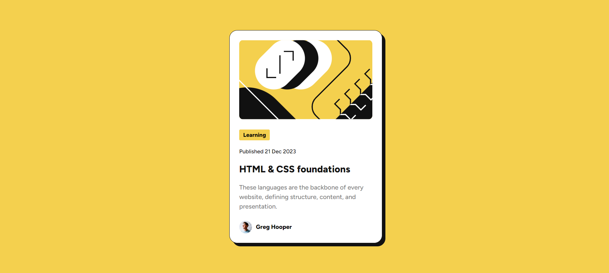
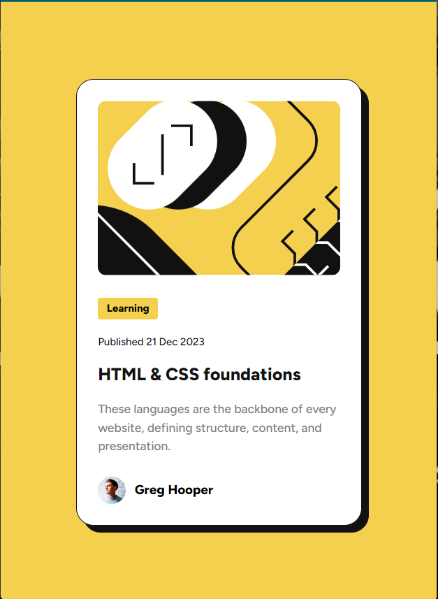

# Blog Preview Card

This is a solution to the [Blog preview card challenge on Frontend Mentor](https://www.frontendmentor.io/challenges/blog-preview-card-ckPaj01IcS). Frontend Mentor challenges help you improve your coding skills by building realistic projects.

## Overview

### The challenge

Users should be able to:

- Build out this blog preview card component and get it looking as close to the design as possible.
- View the optimal layout depending on their device's screen size.
- See hover and focus states for all interactive elements on the page

### Links

- Solution URL: [Blog Preview Card Solution](https://www.frontendmentor.io/solutions/responsive-blog-preview-card-using-html-and-css-mKfLAr6S3c)
- Live Site URL: [Blog Preview Card Live](https://keertyverma.github.io/frontend-mentor-challenges-solutions/blog-preview-card/)

### Screenshot

#### Desktop layout

#### Mobile layout

### Built with

- Semantic HTML5 markup
- CSS custom properties
- Flexbox
- Mobile-first workflow

## What I learned

Good project to refresh HTML & CSS basics.

## Acknowledgments

A big thank you to anyone providing feedback on my solution.It definitely helps to find new ways to code and find easier solutions!
