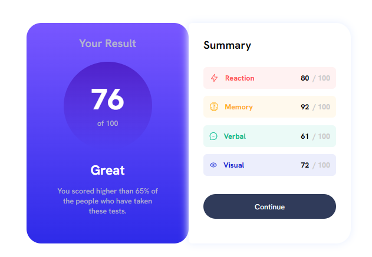

# Result Summary

[Live]() | [Solution]() | [Challenge](https://www.frontendmentor.io/challenges/results-summary-component-CE_K6s0maV)

Solution for a challenge from [frontendmentor.io](https://www.frontendmentor.io/)

### Screenshot

#### Desktop layout

#### Mobile layout

## About The Project

The main challenge is to build out this result summary component and get it looking as close to the design as possible. You can use any tools you like to help you complete the challenge. So if you've got something you'd like to practice, feel free to give it a go.

#### Users should be able to:

1. View the optimal layout depending on their device's screen size.
2. See hover states for all interactive elements on the page.

## Built with

- Semantic HTML5 markup
- CSS custom properties
- Flexbox layout

## What I learned

Good project to practise flexbox layout and basics!

## Acknowledgments

A big thank you to anyone providing feedback on my [solution](""). It definitely helps to find new ways to code and find easier solutions!
